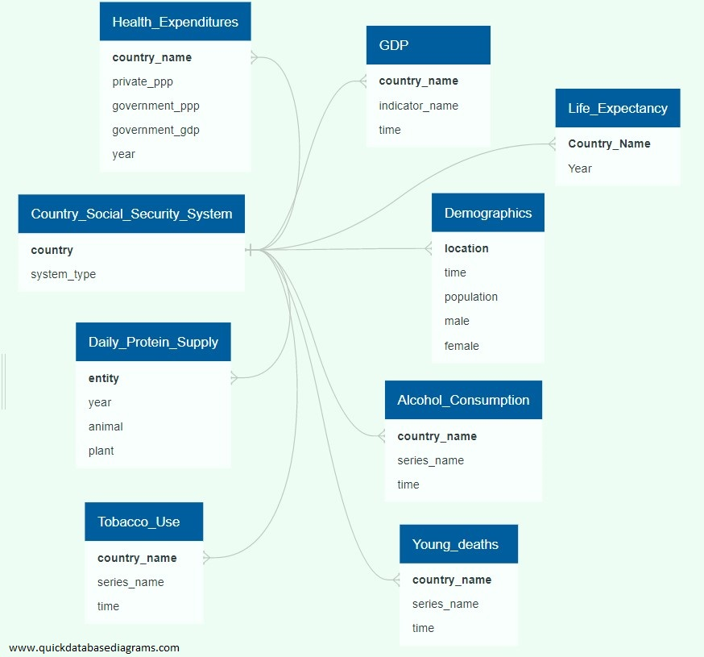

# Expect life - A project about Life Expectancies and Social Security Systems

## Project Overview
This is a team project for data exploration, data analysis, and presentation of findings through a dashboard and visuals.

### Proposal
**Topic**: Life expectancy for nations around the world, and connections to the national social security system.

Questions to be answered by this project: 

* Does the type of social security system impact life expectancy?
* Does the amount of healthcare funding impact life expectancy?
* Does a country's GDP impact life expectancy?
* How big of a role do selected lifestyle factors (for example, alcohol consumption, smoking) play in life expectancy?
* What portion of differences in life expectancy is caused by young deaths (under 65)?
* Other questions - TBD

**Selection Rational**: There are continuing discussions in American politics about the need for changes in the national healthcare system.  Elections have seen candidates propose the adoption of Universal Healthcare or other similar large-scale changes.  This project seeks to explore whether the type of national healthcare system can affect the longevity of the population.  This will be explored with data from nations around the world.

After reviewing the available data, we saw that there was only healthcare system data available for less than half of the world's nations.  However, there is information available about almost all the world's social security systems.  The social security systems include healthcare as well as providing money for retirement and assistance for accidents and emergencies.

This study focuses on the social security programs associated with health (Sickness and Maternity), but can include information about retirement systems, such as for North Macedonia, where the country does not indicate a separate social security system for health.

#### Social Security System Definitions
* Individual account: (may be mandatory or optional)
* Notional defined contribution (NDC)
* Occupational pension system:
* Provident fund:
* Social assistance system:
* Social insurance system:
* Universal system: (system components are identified separately)

## Input Data
Input data was sourced from multiple locations:
* Life Expectancy data was collected from the World Bank.
* GDP data was also collected from the World Bank.
* Social Security system data was collected from ISSA (The International Social Security Association)

### Input Data Issues
We frequently encountered data that was missing data values.  Sometimes for specific metrics in specific years, and other times for collections of metrics within one or more countries.

Another issue that we frequently encountered was data that included general geographic regions, in addition to listing the individual countries.  Because the primary Life Expectancy data and social security system data was oriented towards individual countries, the regional data was processed out of the input data before bringing this information into the database and machine-learning model.

Additionally, there were frequent issues with the individual country names.  This was due to a number of factors, such as, accented characters within the country name, for example `Côte d'Ivoire`, and `Democratic Republic of the Congo` vs. `Congo, Democratic Republic of the`.

#### Gross Domestic Product
The resulting data file contained all of the countries that aligned with the Social Security System data.  Within this collection of countries, the following were dropped because of missing information: British Virgin Islands, Jersey, Slovakia, Taiwan (China), and Venezuela.

### Team Structure and assignments:  
The team has made the following decisions:
* AZ to serve as the project manager
* Team members will work in pairs.  Weeks 1&2: (Jay & Vivek), (AZ & David) - these teams may change in the latter half of the project.
* Google sheet started to collect team availability.  We expect to meet at least every other day for a short stand-up, and have the option to extend or reconvene for more discussion/working sessions.
* All team communication and collaboration held over email, Slack, and Google Meet or Hangouts. 

### Technology: 
* Data Exploration: Python/Pandas/Jupyter Notebook.
* Database exploration: PostgreSQL database engine.
* Machine Learning: Python & Scikit-Learn.  Maybe also Tensorflow.
* Heroku for project hosting, includes webserver and postgres db.
* Presentation: Interactive JavaScript Leaflet Map

## Architecture and Design
The high-level archictecture for this project is depicted below:

#### Architecture and Design Description
The User Interface/Dashboard will be presented to the user via a web page.  The web page will interact with a PostgreSQL database to request data from display on the web page.  The Machine Learning model will interact with the PostgreSQL database to collect the input data and provide results back to the database.

All of these components will be hosted within Heroku.

Below is a high-level diagram of the User Interface/Dashboard:

## Deliverables:

### Database: 
* PostgreSQL Database - We decided to exploring other cloud database instead of setting up one with Heroku. We are currently looking into AWS Postgres, OCI Cloud Free Tier, and Google Cloud SQL For PostgreSQL. 
* The collected project input data will not exceed the limitations of the minimal environment.  

Below is a list of features we identified and will use for our analysis.
- Age 
- Gender
- Population
- GDP (USD)
- Tobacco use
- Alcohol use
- Daily Protein Supply

### Machine Learning Model
* Machine Learning Model - will evaluate the data features and provide information about the feature importance, as well as clustering of features that contribute to Human Longevity.

### Presentation
* Presentation - Interactive Maps (sample provided below):

Originally we depicted life expectancy data on html page using JS Leaflet:
* 

Now began creating interactive maps in Tableau, which will be the ultimate location of our final dashboard:

* Features "Year" slider that will allow user to adjust graphs accordingly for a year of interest between 2000-2019
* Further metrics are to be added as graphs/maps once data is aggregated into GeoJSON file

Further Fleshing Out of Tableau Dashboard to Include Full Life Expectancy Page

### Data Accreditation:

* Life Expectancy/Population: https://population.un.org/wpp/Download/Files/1_Indicators%20(Standard)/CSV_FILES/WPP2022_Demographic_Indicators_Medium.zip
* GDP: https://data.worldbank.org/indicator/NY.GDP.MKTP.CD?end=2021&start=1960
* Other data: https://databank.worldbank.org/source/world-development-indicators
* ISSA - The International Social Security Association (ISSA) is the world’s leading international organization for social security institutions, government departments and agencies.  The ISSA compiles international country profiles with information about the scope and breadth of each country's social security program(s).  They provided the type of system employed by each of the countries in this study, as well as the definitions of the system types.  Links to the country profiles are included within the `country_profile_urls.csv` file.
