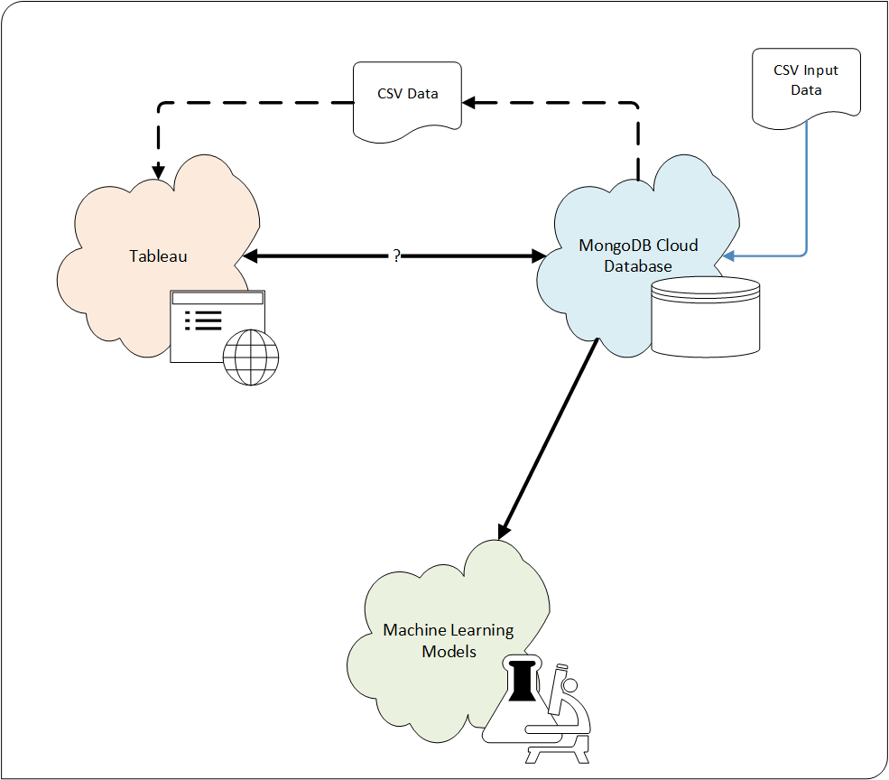

# Expect life - A project about Life Expectancies and Social Security Systems

## Project Overview
This is a team project for data exploration, data analysis, and presentation of findings through a dashboard and visuals.

### Proposal
**Topic**: Life expectancy for nations around the world, and connections to the national social security system.

Questions to be answered by this project: 

* Does the type of social security system impact life expectancy?
* Does the amount of healthcare funding impact life expectancy?
* Does a country's GDP impact life expectancy?
* How big of a role do selected lifestyle factors (for example, alcohol consumption, smoking) play in life expectancy?
* Other questions - TBD

**Selection Rational**: There are continuing discussions in American politics about the need for changes in the national healthcare system.  Elections have seen candidates propose the adoption of Universal Healthcare or other similar large-scale changes.  This project seeks to explore whether the type of national healthcare system can affect the longevity of the population.  This will be explored with data from nations around the world.

After reviewing the available data, we saw that there was only healthcare system data available for less than half of the world's nations.  However, there is information available about almost all the world's social security systems.  The social security systems include healthcare as well as providing money for retirement and assistance for accidents and emergencies.

This study focuses on the social security programs associated with health (Sickness and Maternity), but can include information about retirement systems, such as for North Macedonia, where the country does not indicate a separate social security system for health.

#### Social Security System General Definitions
Note:  In all cases, parenthetical benefits are defined as the ONLY benefits provided by the system.
* Social assistance system: A scheme to provide benefits to low-income residents.
* Social insurance system:  An insurance scheme provides support/benefits to residents.
* Universal system: (system benefit components are identified separately) A scheme where services/benefits are provided for free or minimal cost.
* Employment-related: Employed, self-employed, and persons with limited income may receive specific benefits.
* Employer-Liability: Employed persons may receive specific benefits.

## Input Data
Input data was sourced from multiple locations:
* Life Expectancy data was collected from the World Bank and the World Health Organization.
* GDP data was collected from the World Bank.
* Social Security system data was collected from ISSA (The International Social Security Association)

### Input Data Issues

We frequently encountered the following types of input data issues.
* Country naming conventions
* Data Organization
* Missing data
* Out-of-date Data

#### Country Naming
Country names were presented in different ways, depending on the information source.  Different naming conventions included a number of factors, such as, accented characters within the country name, for example `Côte d'Ivoire`, and the fullness of country names, such as, `Democratic Republic of the Congo` vs. `Congo, Democratic Republic`.

Since the national social security system data was very complete, these names were used as the basis for standardizing the other data sets and country naming.  Note that some of the country names were shortened to their more commonly recognized form to facilitate mapping.  (For example, `Bolivia, Plurinational State of` was shortened to `Bolivia`.

#### Data Organization
Another issue that we frequently encountered was data that included general geographic regions, in addition to listing the individual countries.  Because the primary Life Expectancy data and social security system data was oriented towards individual countries, the regional data was processed out of the input data before bringing this information into the database and machine-learning models.

#### Missing Data
The data sets were frequently missing data values.  Sometimes for specific metrics in specific years, and other times for collections of metrics within one or more countries.

This presented a large challenge, as the process of combining the various datasets would ultimately reduce the represented countries down to those that had data across all the features.  The Alcohol & Tobacco usage, the food supply, and the daily protein intake were the three most restrictive datasets.

#### Out-of-date Data
Another challenge was associated with locating complete data sets across consistent years.  For purposes of the clustering analysis, the most current data was used for each dataset, as this would be unlikely to affect the models' ability to make connections across the features.

However, for purposes of determining feature importance through supervised machine learning, this required ---@David - TBD.

Also, for mapping within Tableau, this required --- @Vivek - TBD.

#### Gross Domestic Product
The resulting data file contained all of the countries that aligned with the Social Security System data.  Within this collection of countries, the following were dropped because of missing information: British Virgin Islands, Jersey, Slovakia, Taiwan (China), and Venezuela.

### Team Structure and assignments:  
The team has made the following decisions:
* AZ to serve as the project manager
* Team members will work in pairs.  Weeks 1&2: (Jay & Vivek), (AZ & David) - these teams may change in the latter half of the project.
* Google sheet started to collect team availability.  We expect to meet at least every other day for a short stand-up, and have the option to extend or reconvene for more discussion/working sessions.
* All team communication and collaboration held over email, Slack, and Google Meet or Hangouts. 

### Technology: 
* Data Exploration: Python/Pandas/Jupyter Notebook.
* Database: MongoDB free tier - M0 cloud database
* Machine Learning: Python & Scikit-Learn.
* Presentation: Tableau

## Architecture and Design
The high-level archictecture for this project is depicted below:

#### Architecture and Design Description
The Dashboard will be presented to the user via Tableau Public.  Tableau may connect to the MongoDB, or be provided data in CSV format.  The Machine Learning model will interact with the MongoDB cloud database to collect the input data and generate results.

Below is a high-level diagram of the User Interface/Dashboard:

## Deliverables:

### Database: 
* MongoDB Cloud Database - We decided this is the best option for the collection of data we are gathering and processing for this project. 
    * The collected project input data will not exceed the limitations of the minimal environment.  

    

We are working with a subset of our data that was imported into the database.

Below is a list of features we identified and will use for our analysis.
- Age 
- Gender
- Population
- GDP (USD)
- Tobacco use
- Alcohol use
- Daily Protein Supply

### Machine Learning Model
* Machine Learning Model - will evaluate the data features and provide information about the feature importance, as well as clustering of features that contribute to Human Longevity.
* Currently, the machine learning model is using PCA for feature reduction, and KMeans for clustering analysis

Because the data under investigation is based on individual countries, the data set is wide (523 feature columns).  To help generate graphable results, Principal Component Analysis (PCA) was used to reduce the feature set down to three primary components.

An Elbow Curve diagram was then generated to help determine the likely number of clusters.

Based on this diagram, n_clusters was set to 3, and then the clusters were predicted.

Because the data was abstracted through the use of PCA, it is difficult to interpret the clustering results.

Additional experiements are underway to try different data combinations and different models, such as KPrototypes.

### Presentation

#### [Tableau Dashboard](https://public.tableau.com/app/profile/vivek.gurumoorthy7572/viz/Life_Expectancy_16711432013830/LifeExpectancyDash?publish=yes)

* Presentation - Interactive Maps (sample provided below):

Originally we depicted life expectancy data on html page using JS Leaflet:
* 

Now began creating interactive maps in Tableau, which will be the ultimate location of our final dashboard:

* Features "Year" slider that will allow user to adjust graphs accordingly for a year of interest between 2000-2019
* Further metrics are to be added as graphs/maps once data is aggregated into GeoJSON file

Further Fleshing Out of Tableau Dashboard to Include Full Life Expectancy Page
Year 2000:

Year 2019:

Dashboard: Life Expectancy

### Google Slide Presentation
Below is a link to the team slide deck:

[Google Slides Presentation](https://docs.google.com/presentation/d/1GDFdQnD2gt4tPtTPS35o6d5ekbh1FRK6IDjy1pRzjho/edit?usp=sharing)

### Data Accreditation:

* [World Bank: Life Expectancy](https://data.worldbank.org/indicator/SP.DYN.LE00.IN)
* [World Health Organization: Life Expectancy](https://www.who.int/data/gho/data/indicators/indicator-details/GHO/life-expectancy-at-birth-(years))
* [Data Population from United Nations Population Fund](https://www.unfpa.org/data/world-population-dashboard)
* [World Bank: GDP](https://data.worldbank.org/indicator/NY.GDP.MKTP.CD?end=2021&start=1960)
* [Additional World Development Indicators](https://databank.worldbank.org/source/world-development-indicators)
* [ISSA - The International Social Security Association (ISSA)](https://ww1.issa.int/) 

ISSA is the world’s leading international organization for social security institutions, government departments and agencies.  The ISSA compiles international country profiles with information about the scope and breadth of each country's social security program(s).  They provided the type of system employed by each of the countries in this study, as well as the definitions of the system types.  Links to the country profiles are included within the `country_profile_urls.csv` file.
