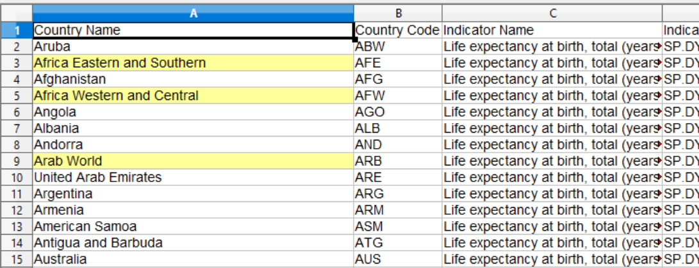
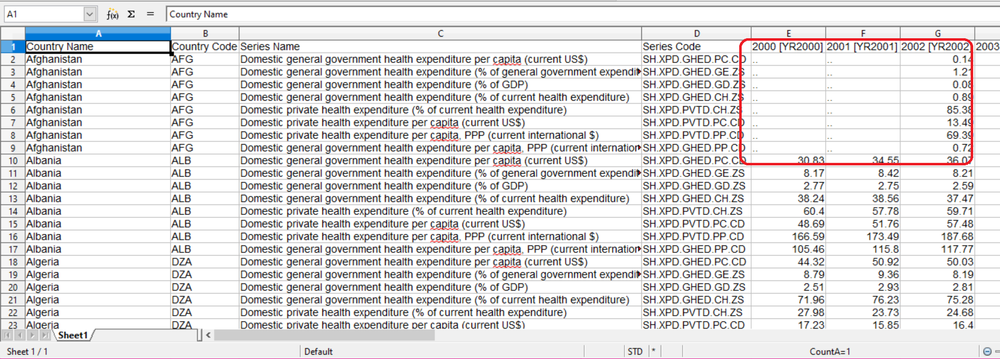
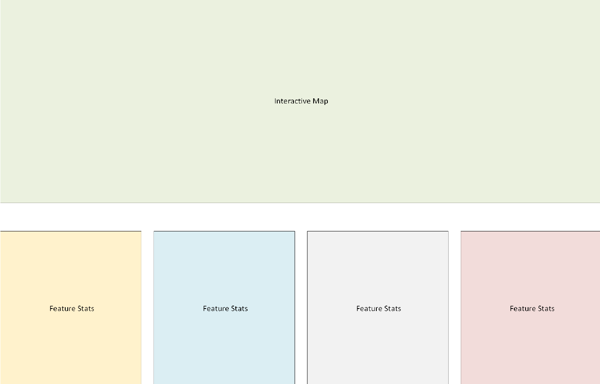
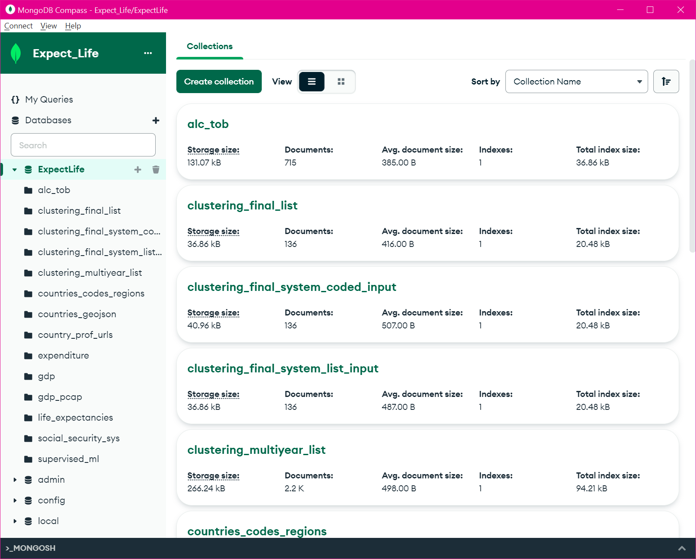

# Expect life - A Glimpse into Global Life Expectancies 

## Project Overview and Purpose
There are continuing discussions in American politics about the need for changes in the national healthcare system.  In recent elections, candidates have proposed the adoption of universal healthcare and other similar large-scale changes to America's healthcare system.  This team project explores what attributes have the largest impact on life expectancy worldwide, and its connection to the national social security system. Using data retrieved from nations around the world, the team seeks to explore whether the type of national healthcare system affects the longevity of the population. Through data exploration, data analysis, and presentation of findings through dashboard and visuals, the team's analysis hopes to answer the following questions:  

* Does the type of social security system have any impact on life expectancy?
* Does the amount of healthcare funding impact life expectancy at all?
* Does a country's GDP impact life expectancy?
* Do selected lifestyle factors (for example, alcohol consumption, smoking) play a role in life expectancy?

#### A Caveat:    

During data exploration, there was only healthcare system data available for less than half of the world's nations.  However, there is sufficient information available for the majority of the world's social security systems.  These social security systems include healthcare as well as providing money for retirement and assistance for accidents and emergencies.

This study focuses on the social security programs associated with health (Sickness and Maternity) but can include information about retirement systems, such as for North Macedonia, where the country does not indicate a separate social security system for health.

## Deliverables:
There are five deliverables in this project:
* A cloud-based database
* Two machine learning models
* An interactive dashboard
* A slide deck presentation of the project
* This repository and README file

### Technology Used: 
* Data Exploration: Python, Pandas, Jupyter Notebook
* Database: MongoDB free tier - M0 cloud database
* Machine Learning: Python, Scikit-Learn, NumPy
* Presentation: Tableau, Plotly, Sweetviz, HVPlot, Seaborn

Note: `requirements.txt` is provided to enable recreation of the analysis environment.

#### Social Security System General Definitions
Note:  In all cases, parenthetical benefits are defined as the ONLY benefits provided by the system.
* Social assistance system: A scheme to provide benefits to low-income residents.
* Social insurance system:  An insurance scheme provides support/benefits to residents.
* Universal system: (system benefit components are identified separately) A scheme where services/benefits are provided for free or minimal cost.
* Employment-related: Employed, self-employed, and persons with limited income may receive specific benefits.
* Employer-Liability: Employed persons may receive specific benefits.

## Input Data
Input data was sourced from multiple locations:
* Life Expectancy data was collected from the World Bank and the World Health Organization
* GDP data was collected from the World Bank
* Food data was collect from the United Nations Food and Agriculture Organization 
* Social Security system data was collected from ISSA (International Social Security Association)
* Mapping vectors and regional codes data were collected from Natural Earth and ISO (International Organization for Standardization)

### Input Data Issues

The following types of input data issues were frequently encountered: 

* Identifying data sources and gathering the data
* Country naming conventions
* Data Organization
* Missing data
* Out-of-date data

#### Identifying Data Sources - Gathering Data
An initial sweep of data sources identified a Wikipedia article as a potential input.  After scraping the article for the country and healthcare system information, it was determined that the data volume was inadequate as it only covered about half of the countries worldwide.

However, the Wikipedia references were useful for identifying other potential related data sources, which led to the use of the ISSA data.  This also required scraping the ISSA website to collect the relevant country and social security system descriptions to enable this analysis.

#### Country Naming
Country names were presented in different ways, depending on the information source.  Different naming conventions included several factors, such as accented characters within the country name, for example, `Côte d'Ivoire`, and the fullness of country names, such as, `Democratic Republic of the Congo` vs. `Congo, Democratic Republic`.
Since the national social security system data was vastly complete, these country names were used as the baseline for standardizing the country naming within other data sets and aligning the content included in those datasets.  Note some of the country names were shortened to their more commonly recognized form to help facilitate mapping.  (For example, `Bolivia, Plurinational State of` was shortened to `Bolivia`.

#### Data Organization
Another issue frequently encountered was data that included general geographic regions, in addition to listing the individual countries.  Because the primary Life Expectancy data and social security system data were oriented toward individual countries, the regional data was processed out of the input data before bringing this information into the database and machine-learning models.

The image below shows a raw input data file that contains various geographical areas that have been highlighted for clarity.

#### Missing Data
The data sets were frequently missing data values.  Sometimes for specific metrics in specific years, and other times for collections of metrics within one or more countries.

This presented a large challenge, as the process of combining the various datasets would ultimately reduce the represented countries down to those that had data across all the features.  The Alcohol & Tobacco usage, the food supply, and the daily protein intake were the three most restrictive datasets.

Within the GDP data file, the following countries were dropped because of missing information: the British Virgin Islands, Jersey, Slovakia, Taiwan (China), and Venezuela.
A full list of countries considered in the supervised machine learning model can be found in the Resources folder (country_list.txt)

#### Out-of-date Data
Another challenge was associated with locating complete data sets across consistent years.  For purposes of the clustering analysis, the most current data was used for each dataset, as this would be unlikely to affect the models' ability to make connections across the features.

## Architecture and Design
The high-level archictecture for this project is depicted below:

#### Architecture and Design Description

Input data was loaded into the MongoDB database in CSV format using MongoDB Compass. The Dashboard is presented to the user via Tableau Public.  Tableau may connect to the MongoDB, or be provided data in CSV format.  The Machine Learning models pull data from the MongoDB cloud database in order to generate results.

Below is a high-level diagram of the User Interface/Dashboard:

### The Database:  [MongoDB Cloud Database](https://www.mongodb.com/)
This was the best option for the gathering and processing of data for this project. Using a non-relational database allows for faster performance because the queries made don't have to view several tables to answer the questions. It was ideal for storing input data that may frequently change over time. Access to the database can be requested from the project team. A temporary username and password can be provided to the interested party. Once access to the database has been granted, instructions to connect to the database can be found at [Resources File](https://github.com/AndrewZinc/Expect_Life/blob/912b5b748bbc4e39e79a6b4f3d12480afd482b59/Resources/MongoDB_Connection_instructions_and_notes.txt). 

Note: modification to the code may be needed depending on the type of operating system. 

The collected project input data will not exceed the limitations of the minimal environment.  

The data is organized into collections according to the intended use of the information.

Below is a list of features identified and will use for our analysis.
- Social Security System information
- Life Expectancy
- Population
- Government Health Expenditure Per Capita
- Private Health Expenditure Per Capita
- GDP Per Capita (USD)
- Government Healthcare Expenditure per Capita
- Private Healthcare Expenditure per Capita
- Tobacco Use
- Alcohol Use
- Daily Caloric and Protein Supply

### Supervised Machine Learning Model
* Machine Learning Model - will evaluate the data features and provide information about the feature importance.

### Clustering Machine Learning Model
The Clustering Analysis seeks to confirm the importance of the features that are identified by the Supervised Machine Learning model.

Because the data under investigation is based on individual countries, the data set can become wide as the categorical features are encoded into numerical values.  To help generate graphable results, Principal Component Analysis (PCA) was used to reduce the feature set down to three primary components.

Silhouette scores and plots were then generated to help determine the likely number of clusters.

Using the best combination of Silhouette score and plot, the target number of clusters is selected and presented to the clustering model for the analysis.

## Analysis Phase

### Clustering Analysis
A key factor in the clustering analysis was the structure of the Social Security System (SSS) info that was presented to the Machine Learning Models.  The SSS data was reviewed and the terminology used to identify the system components were standardized.  The data was then prepared in a simple list format: Country - [SSS list].  After this a `coded` version of the information was prepared, where the SSS components were separated and placed into columns according to the number of components.

An initial review of popular clustering models was perfomed, and several Jupyter notebooks were created to generate data for side-by-side comparison of the model output.  The analysis was performed using different Primary Component Analysis methods (PCA, IPCA, and KernelIPCA) as well as different scalers (StandardScaler, MinMaxScaler, and RobustScaler).

The models examined were:
* KMeans
* Agglomerative Clustering (linkage=complete)
* Agglomerative Clustering (linkage=ward)
* BIRCH
* DBSCAN
* Mean Shift
* OPTICS
* Spectral Clustering
* Gaussian Mixture Model

The results of this preliminary analysis lead to focused examination of:
* Agglomerative Clustering (linkage=ward)
* BIRCH
* Gaussian Mixture Model
* KMeans
* Spectral Clustering

This focused analysis was performed with standard PCA and two different scalers (MinMaxScaler and RobustScaler).  From these new results, MinMaxScaler was selected for final analysis with the BIRCH model.

During the final analysis, the input data was synchronized with the Supervised machine learning model input, both for the volume of data and its contents.  This final analysis was performed through two different Jupyter notebooks and after the analysis was completed, a Sweetviz report was generated to view details of the features and the associations within them.

Single year (latest data) Sweetviz report: [Single Year Sweetviz Report](./Machine_Learning/Final_Results/Final_Report.html)

Multi-year Sweetviz report: [Multi-year Sweetviz Report](./Machine_Learning/Final_Results/MultiYearReport.html)

Additional information about the Clustering experiment processes is available within the [Clustering.md](./Machine_Learning/Clustering.md) file.

## Presentation

### Dashboards: Life Expectancy, GDP per Capita, Tobacco, Alcohol

To acccess the interactive maps visualizing characterizing global spread of analytical metrics, please visit the [Dashboard](https://public.tableau.com/app/profile/vivek.gurumoorthy7572/viz/World_Data_Trends/StatStory?publish=yes). Below are examples of how the filters allow comparisons of regions and sub-regions against one another as well as summary statistics of the selected countries in the metric of interest. 

### Google Slide Presentation
Link to the team slide deck: [Google Slides Presentation](https://docs.google.com/presentation/d/1GDFdQnD2gt4tPtTPS35o6d5ekbh1FRK6IDjy1pRzjho/edit?usp=sharing)

### Team Dynamic and its members:  
* Andrew Z. is project lead and owner of this repository 
* Vivek G. maintains Tableau dashboard
* David S. created supervised machine learning and visualization for presentation
* Jacob V. assist in maintaining database, data collection, presentation slides and other areas as needed 

### Future Work

Moving forwards with this work, we would like to coordinate with local governments and collect more data from them to help identify underlying features that may have impact on life expectancy.  

### Data Accreditation:

* [World Bank: Life Expectancy](https://data.worldbank.org/indicator/SP.DYN.LE00.IN)
* [World Health Organization: Life Expectancy](https://www.who.int/data/gho/data/indicators/indicator-details/GHO/life-expectancy-at-birth-(years))
* [Data Population from United Nations Population Fund](https://www.unfpa.org/data/world-population-dashboard)
* [World Bank: GDP](https://data.worldbank.org/indicator/NY.GDP.MKTP.CD?end=2021&start=1960)
* [Additional World Development Indicators](https://databank.worldbank.org/source/world-development-indicators)
* [United Nation's Food and Agriculture Organization](https://www.fao.org/faostat/en/#data/FS)
* [GeoJson Map Vectors](https://geojson-maps.ash.ms/)
* [Regional Codes](https://github.com/lukes/ISO-3166-Countries-with-Regional-Codes/blob/master/all/all.csv)
* [United Nations - Department of Economic and Social Affairs]( https://unstats.un.org/unsd/methodology/m49/overview) : ISO Country Codes for Tableau dashboard
* [ISSA - The International Social Security Association (ISSA)](https://ww1.issa.int/) 
ISSA is the world’s leading international organization for social security institutions, government departments and agencies.  The ISSA compiles international country profiles with information about the scope and breadth of each country's social security program(s).  They provided the type of system employed by each of the countries in this study, as well as the definitions of the system types.  Links to the country profiles are included within the [Country Profile Urls](./Clean_Data/master_country_list/country_profile_urls.csv) file.
